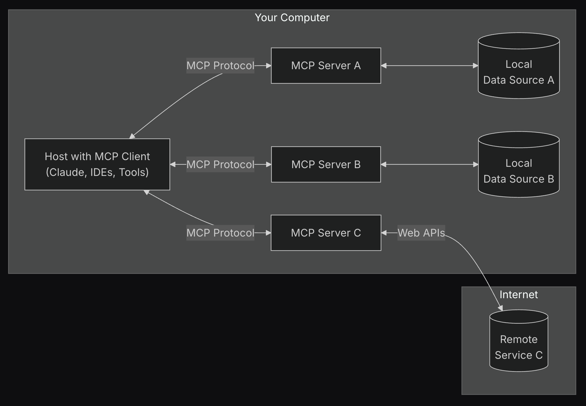

## Why We Are Discussing This

- You might need to build something with an LLM.
- Things are moving so fast, brown-bag to discuss current state-of-the-art.

## What MCP Is:

- Model Context Protocol (MCP) standardises the integration of LLMs with external data sources and tools.
- Think "Web Search" or "Add File" in ChatGPT, but for anything.

## Why: 

- Allows LLMs to be more useful, extends their default tools.
- Eliminates the need for custom / bespoke integrations, ie; Garvis.
- Defines a format that all LLMs can understand, this was previously hit-and-miss at best.
- Community needed an open standard, developed by Anthropic, released last Nov 2024.

## Core Components:

- Resources: Data objects (ie; text, images, knowledge) accessible by LLMs (they're just URIs).
- Prompts: Predefined templates guiding LLM interactions (ie; actions, or multi-step flows).
- Tools: Functions executable by LLMs for specific actions (ie; db, search, messaging, ordering).

## Architecture:

- Hosts: Applications integrating LLMs with MCP clients.
- Clients: Connects LLMs to MCP servers.
- Servers: Services providing Components (ie; prompts) and Tools.



## Communication Protocol: 

- Utilizes JSON-RPC 2.0 for structured messaging between clients and servers ​(remember XML-RPC?).

```json
{"jsonrpc":"2.0","id":0,"result":{"protocolVersion":"2024-11-05"},"method":"tools/call","params":{"name":"sandbox_initialize","arguments":{"query":"foo","conn_id":"04e7d4d1-4d20-5239-a3bb-6a4e6d863e2f"}}}
```

## Transport Mechanisms:

- Server-Sent Events (SSE): For remote integrations, enabling server-to-client streaming over HTTP/S. ​
- Standard Input/Output (stdio): For local integrations via standard input/output streams. (cli, pipes)

## The Good Things:

- Easier for developers to build useful things with LLMs (more deterministic, test-driven).
- Heaps of community-driven integrations (https://github.com/modelcontextprotocol/servers).
- It's a lightweight and common abstraction layer.

## Not So Great:

- It's yet another abstraction layer (manage, patch, monitor, scale, etc).
- Security and authentication is a secondary concern, not defined in the standard.
- Stdio is very flexible but risky, ie; command-line exploits.
